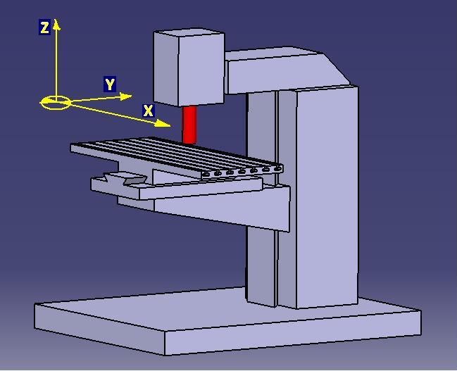
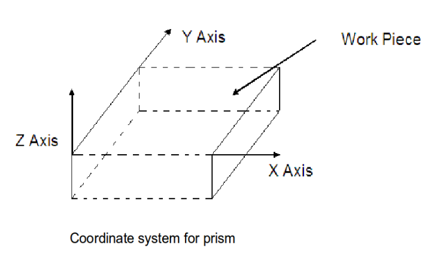
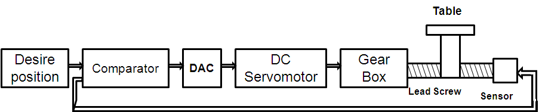
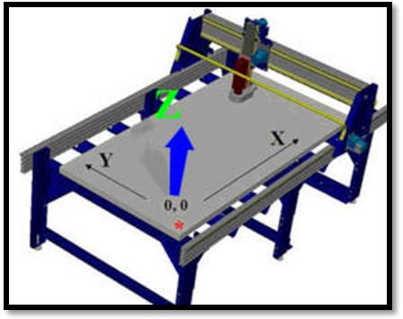

### Theory

Utilization of computers in manufacturing applications has proved to be one of the most significant developments over the last couple of decades in helping to improve the productivity and efficiency of manufacturing systems.

**What is Metal cutting operation?**

The metal cutting operations (also called machining) is one of the most important manufacturing processes in industry today, Machining is the removal of materials in forms of chips from the workpiece by shearing with a sharp tool.

**What are the main functions of Machine tool?**

The main function of a machine tool is to control the workpiece-cutting tool positional relationship in such a way as to achieve a desired geometric shape of the workpiece with sufficient dimensional accuracy.

Machine tool provides:

* work holding
* tool holding
* relative motion between tool and workpiece
* Primary motion -cutting motion & cutting speed.
* secondary motion-feed motion and feed rate

**CLASSIFICATION OF MACHINE TOOLS**

|single point cutting tools 	|    multipoint cutting tools 	|    abrasive tools |
|----|----|----|
|  Lathe machines 	   | 	Drilling machines 	  |  	Grinding machines|
|  Shaper Machines 	   | 	Milling machines 	  |  	Honing machines|
|  Planer machines 	   | 	Broaching machines 	 | |
|  Boring machines 	   | 	Hobbing machines  | |

**Numerical Control (NC) and Computer numerical control (CNC)** Numerical control refers to the operation of machine tools from numerical data. Data for the operations may be stored on paper tape, magnetic tape, magnetic disks, etc. Because numerical information is used, the concept is called numerical control. Numerical control is the operation of machine tools and other processing machines by a series of coded instructions. With a built-in computer controlling the machine tool functions and the system is known as computer numerical control (CNC).

**A typical numerical control machine tool system contains three basic components:**

1. A program, that is, a set of instructions
2. A machine control unit (MCU)
3. The machine tool.

**Figure shows these three basic components.**

In the NC system, all the information which is required for producing a component, viz. dimensional information. speed, feed, and cutting speed is stored in the coded form as a part program.

The MCU is further divided into two elements: The data processing unit (DPU) and control loops unit (CLU). The DPU processes the coded data read from the tape or other storage media and passes information on (i) the position of each axis, (ii) required direction of motion, (iii) speed, feed, and (iv) auxiliary function control signals to CLU. For example, a typical part program may contain an instruction

X + 100, Y + 50, S + 90

This instruction is interpreted as: to move by a distance of 100 mm in the X-positive direction, 50 mm in the Y-positive direction and rotate the spindle at 90 rpm clockwise. These information pieces are decoded by the DPU and sent to CLU.

The CLU operates the drive mechanisms of the machine to move the table in X and Y directions, and to rotate the spindle as specified. Then it receives feedback signals concerning the actual position and velocity of each of the axes, and signals for completion of the operation. When execution of one line (instruction) as noted by the CLU is complete, another instruction is read. A data processing unit consists of some or all of the following parts:

* Data input device such as a paper tape reader, magnetic tape reader, etc.
* Data reading circuits and parity checking logic
* Decoding circuits for distributing data among the controlled axes
* An interpolator, which supplies machine-motion commands between data points for tool motion.
* A control loops unit, on the other hand, consists of the following:
* Position control loops for all the axes of motion, where each axis has a separate control loop
* Velocity control loops, where feedback control is required
* Deceleration and backlash take up circuits
* Auxiliary functions control, such as coolant on/off, gear changes, spindle on/off control.

Geometric and kinematics data are fed from the DPU to the CLU. The CLU then governs the physical system based on the data received from the DPU.
Processing equipment is the third basic component of the NC system.
It is the machine tool that performs the useful work. The machine tool is designed or modified to be controlled, operated, and interfaced with the Control Loop Unit (CLU).

**Advantages of NC system**

NC systems offer several advantages over the conventional manufacturing methods. These are:

1. High machine utilization
2. Need for special tooling is mostly eliminated
3. High quality products can be manufactured
4. Consistency in quality
5. Quality is not dependent on the operator's skill
6. Lesser production cost per unit
7. Reduced scrap
8. Reduced in-process inventory
9. Higher productivity
10. Reduced set-up time.

**Disadvantages of 'NC system**

1. Very high initial investment on specialized equipment
2. Redundancy of labour
3. Downtime of NC is highly expensive
4. Special skill is required for programming and operating equipment.

**Comparison between conventional machines and NC machines**

1. The NC machine differs from a conventional machine in many ways. Different aspects of the two are compared here.
2. New NC machines cost around two to five times more than the similar capacity conventional machines, depending upon the sophistication of the control system and the size of the machine.
3. Conventional machines require a high order of skill and trained personnel to operate to produce complex contours.
4. The machine hour rate is generally higher for the NC machines or the down time of these machines is very costly.
5. Maintenance of NC machine is costlier than the conventional machine.
6. The production rate of NC machines is higher than that of the conventional machines and they can produce complicated profiles consistently with good accuracy.
7. NC machines require special tooling. Because, these machines are designed to operate at the very high operating conditions (today, NC machines are capable of operating at 50,000 rpm) Tools made from carbon tool steel and HSS cannot be used at such a high speed.
8. Use of automatic tool changers to change the tool automatically and simultaneous machining by multiple tools are the features available with high-end NC machines. These features help to reduce down time set-up time.

**Coordinate systems and Program Zero Point**

To describe the geometry of a workpiece for NC programming, we use coordinate systems with X-, Y- and Z-axes. The origin of the frame and the alignment of the axes are chosen in such a way that any point on the workpiece can be defined by naming its X, Y and Z coordinate values. A coordinate frame attached to the corner of a prism is shown in Fig.2. The directions of X, Y, Z axes illustrated in Fig. 2 are treated as the positive directions and the movement of the tool in the opposite direction is treated as negative.

The point of intersection of the three axes (the origin) is called zero point. A point at a distance 60 mm from the zero point in positive X direction and 30 mm in positive Y direction is denoted as:
X + 60, Y + 30
and a point 10 mm below the top surface at the above location is denoted as:
X + 60, Y + 30, Z - 10
It is also possible that we can locate the origin of another coordinate frame anywhere in the workpiece. This new origin of frame is called program zero point. All coordinate values in the program may be referred relative to the program zero point. The different locations of program zero point are illustrated in Fig. 3

With a program zero point at the lower left corner of a workpiece, the coordinate values of X + 50, Y + 60, Z + 30, for example, would mean that the tool is required to move to a point located 50 mm away from the program zero point in positive X direction, 60 mm away in positive Y direction and 30 mm away in positive Z direction. This is shown in Fig.4

**Classification of Numerical Control Machines.**

Numerical control machines can be generally classified using the following categories:
1. Type of motion
2. Programming method
3. Control system

**Type of motion**
According to the type of motion, NC machines can be classified as:
1. Point-to-point systems
2. Contouring or continuous systems

**Point-to-point systems** In case of point-to-point (PTP) motion machine tool, the cutting tool moves to a numerically defined location, the motion is stopped and the task is performed. After completing the task, the tool moves to the next point and the cycle is repeated. In a PTP system, the path of movement of the tool and its velocity, when the tool moves from one point to another, is of no significance.

**Contouring or continuous systems** The tool has to move in a predetermined path in the case of contouring or continuous systems. For example, consider the component ABCD, as shown in Fig. 5 (b), to be cut from the material. To manufacture this component, the tool has to move in a predefined contour (path) A-B-C-D. The intermediate points of the contour are obtained by interpolator, which is contained in DPU of the processing systems. That is, while moving from A to B (or B to A) in Fig. 5 (b) we just need to input the coordinates of points A and B, then define whether these points A and B are joined by a straight line or an arc then interpolator automatically calculates all the intermediate points between A and B and accordingly gives the signal such that the tool is moved in the respective path.

**Programming method**
According to programming method used, NC system can be classified into two categories as:
1. Absolute positioning
2. Incremental positioning (or Chain positioning)

**Absolute positioning**

In absolute positioning, the coordinates of the target point are defined with respect to a fixed program zero point. Absolute dimensions tell the control to what point the tool is to move, regardless of its current position. Figure 6 shows absolute positioning for point B, irrespective of whether the tool was at A or at C. It can be observed from Fig. 6 that all the values are based on the program zero point. The positional command for the tool to reach point B would be X + 70, Y + 30

**Incremental positioning**

Incremental or chain positioning tells the control by what amount the tool is to move from its present position. The present position of the tool acts as the program zero point. Chain positioning for point B from point A and from point C are shown in Figs. 7 and 7(b), respectively. Each coordinate value is based on the end point of the previous location. The positional command for the tool to reach B from A would be X + 50, Y + 20 and to reach B from C would be X + 30, Y - 10

**Control system**

According to the type of control systems used, NC systems can be classified as:
1. Open loop system
2. Closed loop system.

Every control system, including NC systems may be designed as open loop or closed loop control.

**Open loop system:**

The term open loop means that there is no feedback, and the action of the controller has no information about the effect of the signal that it produces. Figure 8 shows an open loop control for a single axis of motion. Since there is no feedback information, the system accuracy is solely a function of the motor's ability to pass through the exact number of steps, which is provided at its input.

**Closed loop system:**

In a closed loop control system, the actual position and the velocity of the axis are measured with sensors. The schematic diagram of the closed loop system is shown in Fig. 9. Assuming a digital control system, a digital to analogue convertor (DAC) is included in Fig. 9

The difference between actual and the programmed value is termed as the- error. The control system is designed in such a way so as to eliminate the error or reduce it to a minimum.

**Advantages of CNC Systems over Conventional NC Systems**

* Because the computer can be readily and easily reprogrammed, therefore, the system is very flexible.The machine can manufacture a part followed by other parts of different designs.
* More versatility. Editing and debugging programs, reprogramming and plotting and printing part shapes are simpler
* Program to manufacture a component can be easily called. This saves time and eliminates errors Due to tape reading
* Greater accuracy.

**What is CNC wood router?**

A CNC wood router is a Numerical control tool that creates objects from wood. Parts of a object can be made and then assembled using a router to produce a complete object.
The CNC router works like a printer. Work is composed on a computer and then the design or drawing is sent to the CNC router for the hard copy. This outputs a 3-dimensional copy of the work. The CNC router uses a cutting tool instead of an ink jet. The cutting tool is generally a router but other cutters can be used as well.
A CNC wood router uses CNC (computer numerical control) and is similar to a metal CNC mill with the following differences:
* The wood router typically spins faster - with a range of 13,000 to 24,000 RPM
* Low end hobby grade machines typically uses smaller tools - typical shank size 20 mm or at most 25 mm. Professional quality machines frequently use surface facing tools up to 3" in diameter or more, and spindle power exceeding 15 horsepower.

[Youtube Reference Link - https://www.youtube.com/embed/jCG9GOJWT2I](https://www.youtube.com/embed/jCG9GOJWT2I)

Machines capable of routing heavy material at many hundreds of inches per minute are common. 
Some machines use smaller tool holders MK2 (Morse taper #2 - on older machines), ISO-30, HSK-63 or the tools just get held in a collet tool holder affixed directly to the spindle nose. ISO-30 and HSK-63 are rapid-change tool holding systems. HSK-63 has begun to supplant the ISO-30 as the rapid change standard in recent years.
A wood router is controlled in the same way as a metal mill, but there is a lot of CAM and CAD software like Artcam, Mastercam, Bobcad, and Featurecam specifically for wood routers.
Wood with different grain must be approached with unique strategies, and wood CAM software is less likely to need to have hog-out strategies than the metal ones. Wood routers are frequently used to machine other soft materials such as plastics at high speed. Typical three-axis CNC wood routers are generally much bigger than their metal shop counterparts. 5' x 5', 4' x 8', and 5' x 10' are typical bed sizes for wood routers. But can be built to accommodate very large sizes up to, but not limited to 12' x 100'. Most table routers use a three motor drive system (xyz) utilizing either servo or stepper motors that drive the router motor via a gantry system. The gantry system isolates the XYZ movement in the top part of the machine with a stationary table holding the workpiece. Many CNC metal mills have the cutter motor moving on the Z axis, and a table which moves in X and Y for added stability.
Many wood routers can run at machining speeds of 25 metres/min (linear) or faster with a few machines such as the Anderson capable of 40 metres/min, Onsrud capable of 86 metres/min.

**Separate heads**

Some wood routers have multiple separate heads that can come down simultaneously or not. This design is generally not as easy as a tool changer with ISO-30 or HSK-63, though it is easier to maintain. Some routers have multiple heads that can run complete separate programs on separate table all while being controlled by the same interface.

**Dust collection**

The wood router typically has 6"-10" air ducts to suck up the wood chips/dust created. They can be piped to a stand-alone or full shop dust collection system. Some wood routers are specialized for cabinetry and have many drills that can be programmed to come down separately or together. The drills are generally spaced 32 mm apart on centres - a spacing system called 32 mm System. This is for the proper spacing of shelving for cabinets. Drilling can be vertical or horizontal (in the Y or X axis from either side/end of the workpiece) which allows a panel to be drilled on all four edges as well as the top surface. Many of these machines with large drilling arrays are derived from CNC point-to-point borers.

**Applications**

**CABINETS** - Making cabinet components on a CNC router has become a common practice today. The technology of manufacturing cabinet boxes, doors, drawer fronts, shelves and even countertops with a robotic tool is now well within the reach of smaller shops. Using CNC technology, cabinetmakers are now able to increase production throughput, while minimizing material handling.

**WOODWORKING** - In addition to high-volume furniture and millwork companies, novice and master craftsmen alike are embracing CNC technology in their workshops.

**SIGNS** - CNC Wood routers are used in sign making to carve images in wood and foam, to cut plastic and aluminium letters, and to intricately machine the all sorts of graphic objects and letters. Full 3D cutting capabilities allow cutting and machining of practically anything.

**BOATS** - Boatbuilding is a natural for utilizing the benefits of CNC technology, In boatbuilding, CNC Wood routers are used for cutting frames, plywood panels and all manner of interior and exterior parts. They are used in wood, fiberglass and aluminium production processes.

**INSTRUMENTS** - Luthiers of all disciplines can now supplement their traditional woodworking tools with CNC routers. While the CNC may not duplicate all of the specialized processes involved in instrument making, it brings new capabilities that can transform an ordinary shop to an extraordinary one.

[Youtube Reference Link - https://www.youtube.com/embed/jCG9GOJWT2I](https://www.youtube.com/embed/xdtkyjWO4rE)

